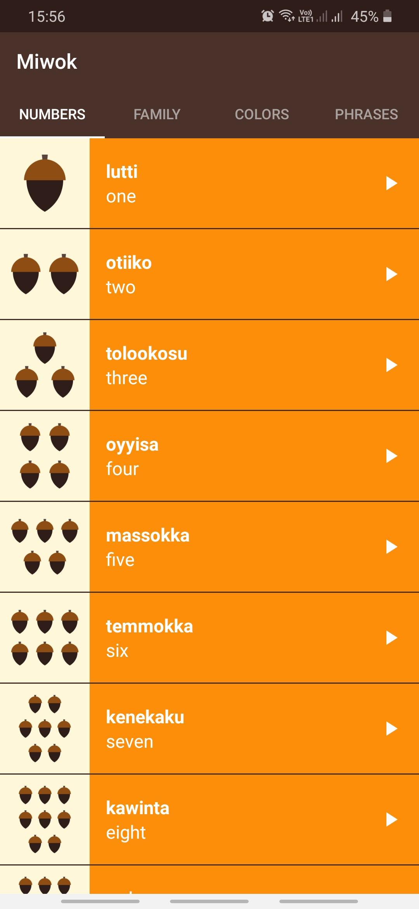
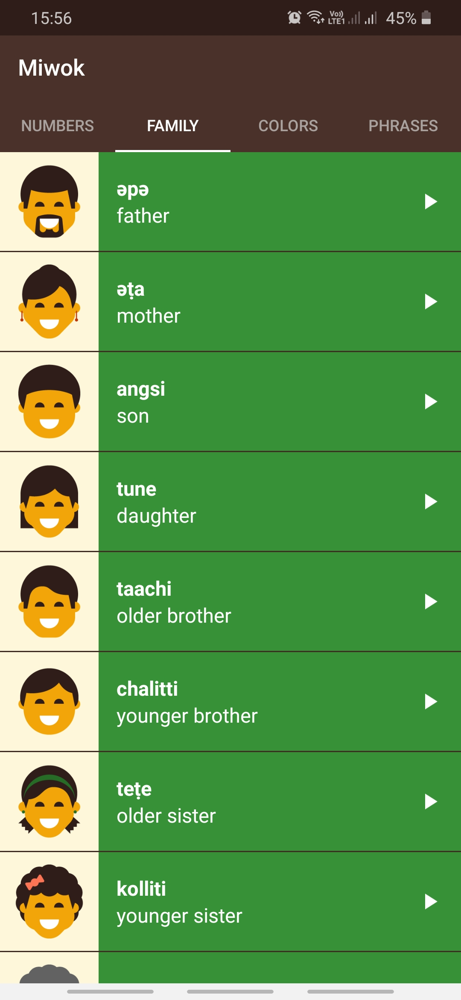

# Miwok App

Android app to display lists of vocabulary words for the user to learn the Miwok language (a Utian language, 
related to other California Indian languages, and spoken in central California in the Sierra Nevada).

Features
--------
- Miwok vocabulary words for four categories - numbers, family members, colors, and phrases
- Images for numbers, family members, and colors categories for visual recall
- Miwok pronunciation of each word through an audio file

Pre-requisites
--------------
- Android SDK v29
- Android Build Tools v28.0.3
- Android Support Repository v23.3.0

Deployment
----------
This app uses the Gradle build system. To build this project, use the
"gradlew build" command or use "Import Project" in Android Studio.

Screenshots
-----------

